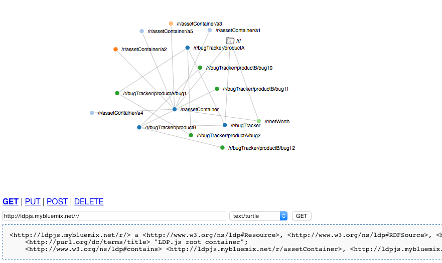

# ldp-app

A simple Node.js Express app that uses the ldp-service Express middleware to create a simple LDP server.  The app displays LDP resouces accessed using the ldp-service middleware and displays their content, and a graph visualizing the objects and the relationships between them. Catch it running at
[http://ldpjs.mybluemix.net](http://ldp-app.mybluemix.net).

ldp-app uses the ldp-service Express middleware module which supports LDP basic and direct containers. Indirect containers and non-RDF source are not implemented.

## Running

First, install [Node.js](http://nodejs.org). Next, install and start
[MongoDB](http://docs.mongodb.org/manual/installation/).

Configuration defaults can be found in config.json.

To start the app, run these commands

    $ npm install
    $ node app.js

Finally, point your browser to
[http://localhost:3000/](http://localhost:3000/).

## License

Licensed under the Apache License, Version 2.0 (the "License");
you may not use this file except in compliance with the License.
You may obtain a copy of the License at

   http://www.apache.org/licenses/LICENSE-2.0

Unless required by applicable law or agreed to in writing, software
distributed under the License is distributed on an "AS IS" BASIS,
WITHOUT WARRANTIES OR CONDITIONS OF ANY KIND, either express or implied.
See the License for the specific language governing permissions and
limitations under the License.
